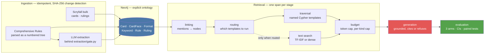
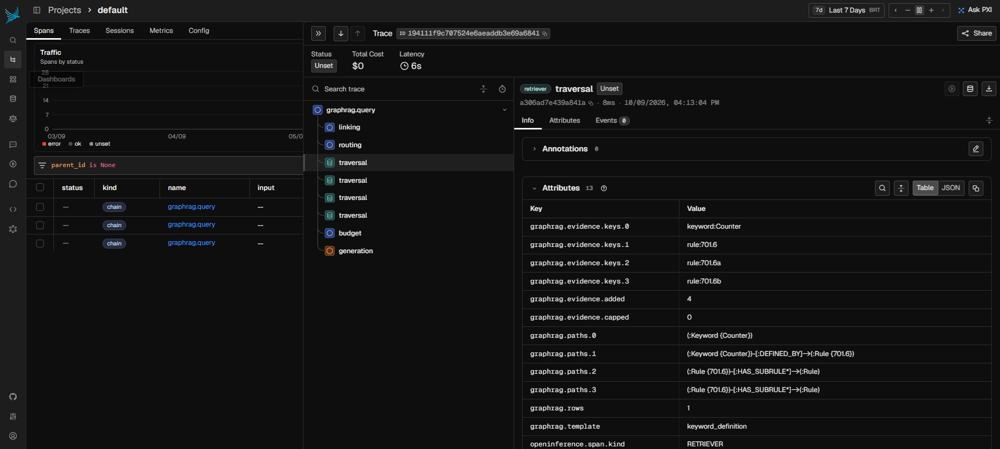

# graphrag-mtg-rules

**The graph that resolves the stack** — a GraphRAG system that answers
judge-level *Magic: The Gathering* rules questions by traversing a
knowledge graph and citing the path it took.

> *Part 2 of a 3-project RAG series:*
> **[rag-pix-regulation](https://github.com/brunoramosmartins/rag-pix-regulation) (vector) → graphrag-mtg-rules (graph) → agentic-rag (router, upcoming).**

---

## The problem

Vector RAG answers questions whose answer is *written somewhere*:
retrieve the passage, cite it, done. But a whole class of rules
questions has no such passage — the answer is a **path** through the
system:

> *"I control Humility and Opalescence — what happens?"*

Nobody wrote that answer down. It emerges only by traversing
card → ruling → the layer system (CR 613) → sub-rules → timestamps.
This project represents the official knowledge — Scryfall oracle data,
the **Comprehensive Rules** parsed as a numbered tree with
cross-references, and official rulings linked by metrics-validated LLM
extraction — as a graph with an **explicit ontology**, and answers by
**traversal with path + rule-number citations**.

The claim is measured, not asserted: the pipeline is first **calibrated
on an academic multi-hop benchmark (MetaQA)**, then run **head-to-head
against a vector baseline** (the Project 1 pipeline over the same text)
on a **judge-curated golden set** (RulesGuru). See
[`docs/hypothesis.md`](docs/hypothesis.md).

## The result

**The hypothesis was not confirmed.** On the 57-question evaluation split,
opened once on 2026-09-12, judge-scored answer correctness is:

| | vector (A) | graph (B) | hybrid (C) |
|---|---|---|---|
| **all 57 questions** | **0.60** [0.47, 0.71] | **0.61** [0.48, 0.73] | **0.65** [0.52, 0.76] |
| `definition_1hop` (11) | 0.73 | **0.91** | **0.91** |
| `legality_1hop` (15) | 0.80 | **0.93** | **0.93** |
| `interaction_multihop` (22) | **0.41** | 0.27 | 0.36 |

The registered analysis — B vs A, exact McNemar, Holm-corrected over the four
strata with n ≥ 7 — returns **`inconclusive` on all four**. Adjusted *p* =
1.0000 throughout. The three arms are indistinguishable at this sample size.

And the direction runs the wrong way. The graph is ahead on the one-hop
strata, where the answer is a typed edge; **the vector baseline is ahead on
`interaction_multihop`** — the 22-question stratum this project's thesis was
written about. That is the opposite of the registered stratification.

Three measurements say why, and each is registered:

- **The gap is vocabulary, not topology.** On the 26 questions the pipeline
  had already failed, the graph retrieves 7 of the 64 rules the answer keys
  require — and a plain lexical index over all 3,308 rules does *worse* at a
  realistic context size (6/64), reaching only 12/64 when pulled to a hundred
  rules per question. A question names cards and player verbs; a rule is
  written in defined terms, and nothing here bridges the register. *(That
  population was selected for being hard, so this says what nothing reaches
  **there** — it is not an estimate of retrieval quality overall.)*
- **The weak link is the model declining, not the model reasoning wrong.**
  Calibrating on MetaQA first: at a matched 16-item context with the complete
  two-step chain *verified* present, correctness is **0.672** against 0.890 at
  one hop — and of those 82 failures, **39 are refusals and 19 are unparseable
  output, against 24 wrong entities.** Fewer than one failure in three is a
  reasoning error.
- **On the Magic side the graph arm's seven "refusals" are mostly not refusals
  at all** *(corrected 2026-09-13, by reading all seven — an earlier version of
  this bullet pooled them and inherited the wrong mechanism)*. **Six carry
  `generated=False`: retrieval resolved no entity and the model was never
  called** — five `no_seed`, one `no_match`. That is entity linking failing,
  not a model declining. The seventh is a real refusal and a correct one: the
  model walked the rules and said the context never gave it the creature's
  toughness.
- **The retrieval comparison is budget-confounded**, by a 3× rule set before
  the split opened. At matched token budget the vector arm keeps a median of
  40.5 items against the graph's 12.0 — 3.38×. So the headline retrieval
  figure is the token-normalised one: **A 0.030, B 0.112**.

Two more results are negative in a way worth reading: the pairwise
head-to-head is **withdrawn** on both contrasts involving the vector arm, by a
pre-registered gate on how often the judge reverses itself when the two
answers swap places (0.333 and 0.368, against a 0.20 limit); and the judge
itself is **published ungated** at 0.727 [0.598, 0.827] agreement against a
0.720 threshold, with its own ceiling beside it.

Every number above was predicted, bounded, or gated in
[`experiments/registry.md`](experiments/registry.md) **before** the run that
produced it. [`docs/evaluation.md`](docs/evaluation.md) is the source of truth
and carries the limitations that bound each one.

**One of them was withdrawn, and the withdrawal is on the record.** The second
bullet used to quote a three-hop figure and conclude that generation, not
retrieval, was the bottleneck — the project's most-repeated sentence. Before
paying for the follow-up experiment built on it, we rendered a single scored
case: a three-hop question whose context held hop one and eleven unrelated
films. The model refused, correctly, and the harness had scored that as a
generation failure. The cause was a chain search that accepted any path to an
accepted answer *string* rather than one that answers the question, and **126
of the 137 questions in that cell (92%) were one-step chains**. The three-hop
column is withdrawn, the follow-up was suspended unspent, and the one- and
two-hop columns — whose chains match their declared depth on every question —
are what the bullet now quotes. The repair, the measurement and what survives
are in the 2026-09-13 amendments to E-002 and E-012.

## Where this graph works, and where nothing built here does

The table above says the vector baseline wins the stratum this project was
written about. It does not say **why**, and "the graph needs more work" was a
guess. Phase 9 opened to repair retrieval so the governing rule would reach the
context, and **closed without shipping a repair, because every repair was
measured to be unavailable before one was built.** Total API spend: **US$ 0.19.**

What came out instead is a bounded claim:

> **This GraphRAG outperforms the vector baseline exactly where its topology
> reaches, and is outperformed outside it.** The reach is not a tuning
> parameter; it is a property of the edges the corpus supports.

**Decompose what retrieval delivers** on `interaction_multihop`, arm B:

| what retrieval has to find | delivered |
|---|---:|
| the cards the question names | **39 / 40** |
| the rulings of those cards | **182 / 191** |
| **the governing CR rule** | **2 / 22** |

Everything reachable from a card arrives at 95% or better. The rule the answer
key says governs arrives on **9%**.

And the budget follows the edges, not the question. Across the whole split,
**50.1%** of arm B's context tokens expand keywords into chapter 700 — the only
chapter reachable from a card. Where the question *is* a keyword definition
that spends the entire budget on exactly the right thing, and the graph answers
**10 of 11** against the baseline's 8. Where it is a multi-card interaction,
**36%** of the budget still goes to keyword definitions, the governing rule
arrives twice in twenty-two, and the graph answers **6 of 22** against 9.

**It is not the graph.** On the same 22 questions the vector arm reaches the
gold rule **2 of 22 — the same two questions**, and both are ones where the
target rule was annotated in-house. Of the **13** whose target was transcribed
from RulesGuru's judge-curated citations, the vector arm reaches **0**, the
graph arm **0**, the hybrid **1**. The governing rule for a multi-card
interaction is not recoverable from the question's surface text or the card's
neighbourhood **by any method built here** — which makes this a property of the
problem, not of one implementation.

**Four repairs, each measured, each unavailable:**

| candidate | measured | outcome |
|---|---|---|
| the bridge out of chapter 700 | expanding `REFERENCES` and parent/child both ways from what retrieval delivers | **1 of 39 at one hop (3%)**; the two-hop closure adds a median of 138 rules per question |
| injecting gold rulings | Scryfall's rulings against what arrived | **182 of 191** already there — nothing to inject on 21 of 22 |
| wrong-sense entity linking | glossary entries with multiple numbered senses | **4 questions of 57**, 3.5% of context. Not systemic |
| budget policy | `dropped` and `capped` | empty on every question measured |

And the intervention that would have justified the programme returned nothing:
**injecting the governing rule directly came back `unresolved`** — 2 discordant
pairs where 7:0 was needed. Reading all nine derivable-and-wrong cases with the
prompt as sent puts **four of 16** in "reasoned wrong with the evidence in
hand"; that classification was read case by case and countersigned, and its
denominator is oracle-conditioned, so it is a lead and not a rate.

**This revises no figure in the result above.** It is the scope statement that
was missing from it. Full working, with the limitations that bound each number,
in [`docs/evaluation.md`](docs/evaluation.md) and
[`docs/error-samples/e018.md`](docs/error-samples/e018.md).

## What it costs to get there, and the floor under every number above

The table at the top says the three arms are indistinguishable. **It does not
say they are the same system**, and the difference is not in the answers — it
is in what each one spends to produce them.

Paired within question over the same 57, bootstrapped over questions:

| | vector (A) | graph (B) | B − A | 95% CI |
|---|---:|---:|---:|---|
| context tokens | 3,892 | **744** | **−3,148** | [−3,428, −2,843] |
| evidence items | 38.9 | **12.5** | **−26.4** | [−29.5, −22.9] |
| CR rule items | 2.09 | **5.47** | **+3.39** | [+1.65, +5.37] |
| correctness | 0.60 | 0.61 | +0.02 | **[−0.12, +0.16]** |

> **The graph answers within [−0.12, +0.16] of the baseline's correctness on
> 19% of the context tokens**, while surfacing more of the rulebook.

**"Within ±0.16" is not "the same", and the gap between those two is the point
of the next section.** The economy is a ten-standard-error effect; the
equivalence it rests on is the widest figure in this repository.

### The floor: why "indistinguishable" is a property of the ruler

Before curating anything for a second verdict, we measured what this evaluation
can see at all. **Of the nine paired correctness comparisons this project has
run, zero produced an effect their own samples could have distinguished from
zero at 80% power.**

| n | smallest detectable effect | as an interaction |
|---:|---:|---:|
| 20 | 0.342 | 0.484 |
| **57** | **0.203** | 0.287 |
| 120 | 0.140 | 0.198 |

The largest correctness effect ever measured here is +0.182. **An interaction
costs about four times the questions of the simple effect it is built from** —
one line of arithmetic that, had anyone computed it in September, would have
prevented three registered experiments from being written.

This does not say the effects are zero. It says **every `inconclusive` this
project published was the only answer its instrument could return.**

Publishing a measured floor for one's own evaluation is rarer than a
three-point win, and it is the more transferable of the two. Full working in
[`docs/evaluation.md`](docs/evaluation.md); instruments in
[`scripts/detectability.py`](scripts/detectability.py) and
[`scripts/e027_economy.py`](scripts/e027_economy.py), both zero-cost arithmetic
over runs that already exist.

### And the thing no correctness figure captures

Every evidence item in every arm carries a provenance field, populated **100%
of the time in all three arms**. That number is not the measurement:

| arm | items | with a path | **distinct paths** |
|---|---:|---:|---:|
| A — vector | 2,215 | 100% | **1** |
| B — graph | 710 | 100% | **275** |

The vector arm writes one constant string on every item — *"hybrid retrieval
over the shared corpus"* — which is true of everything an index returns. The
graph arm writes `(:Card {Bring to Light})-[:HAS_RULING]->(:Ruling)`: a claim
about *this* item that a reader can check against the corpus.

```
python scripts/provenance_demo.py --qid rg-1591
```

This is a capability, not a result: it makes no answer more correct, and it is
what a person auditing a rules answer actually uses.

### Three claims, proposed and killed in one day

| proposal | killed by |
|---|---|
| stratum × arm **interaction** on correctness | power at its own declared bar is 0.26; 80% needs 440 questions — more than the 296 that had just disqualified its alternative |
| **gold-rule reach** as the comparison | reach is 11/11 in *all three* arms on `definition_1hop`; the large effect is between strata, not between arms |
| evidence **precision** | the non-overlapping interval was pooled over items clustered inside questions; paired, it is −0.001 [−0.044, +0.039] |

Each died to a measurement available before the proposal was made. That is the
part worth copying.

## Why Magic

The Comprehensive Rules are a genuine dense-regulatory-text proxy —
hierarchical numbering (601.2b), cross-references, exceptions that
override general rules, quarterly updates — with something no corporate
corpus offers publicly: a **ground truth validated by experts at scale**
(judge-curated questions) and an **academic calibration benchmark**. The
techniques transfer 1:1 to legal, regulatory, and fraud domains; Magic
was chosen because it lets us *measure the truth*. Full rationale in
[`docs/adr/adr-001-domain-choice-magic.md`](docs/adr/adr-001-domain-choice-magic.md).

## Status

**Phase 10 — The floor, and what sits above it.** The pipeline runs end to end: the graph,
retrieval, grounded generation, a three-arm evaluation with confidence
intervals, OpenTelemetry spans on every stage, a live demo, and CI that
exercises all three arms with no API key. The evaluation split was opened once
and the result is above. Phase 9 then asked what it would take to close the
retrieval gap, measured four candidate repairs, and shipped none of them.
Phase 10 opened to take a second correctness verdict, measured that no such
verdict was available to it, and published the floor instead. Roadmap:
Phases 0→10 (vector→graph→agentic trilogy).

**What this project is actually a demonstration of.** The graph did not beat
the baseline, and the interesting part is that this is knowable. The
hypothesis was registered in July with its falsifier named; the decision rule
was pinned in August before any arm ran; the split was drawn, frozen, and
touched once. When the answer came back inconclusive there was nothing left to
negotiate — which is the whole point of writing the rule down first. A system
that can only report a win is not an evaluation.

Phase 9 is the same discipline pointed at the follow-up work. Four repairs were
costed from the run's own inputs before any was implemented, and all four were
dropped on the arithmetic. Three defects were found in the measuring
instruments themselves — a noise floor that sampled less variance than the
contrast it guarded, a median that returned the maximum on an even-length list
and thereby confirmed the hypothesis, and a prediction promoted to a decision
boundary inside its own script — and each was written into the registry rather
than quietly corrected. **Knowing what an intervention cannot buy before paying
for it is the deliverable.**

## Quickstart

Docker and nothing else. Timings are measured, not aspirational — see
[`docs/onboarding.md`](docs/onboarding.md).

```bash
cp .env.example .env
# Set NEO4J_PASSWORD, and CR_TXT_URL to the TXT link on
# https://magic.wizards.com/en/rules — that page is JS-rendered, so the
# link cannot be resolved automatically, and WotC replaces the file every
# release without a redirect, so an old URL 404s.

docker compose --profile app up -d --wait
docker compose exec app python scripts/bootstrap.py
```

**~2 min 54 s** from an empty database to a cited answer, plus about a
minute to build the image. Running it again is **~27 s**: every step is
idempotent, so the first run is the cold path and the rest are warm.

That builds the **graph**, which is what the shipped system retrieves
from. The vector baseline it is compared against is a separate index that
costs an embedding call per document — `python scripts/run_eval.py index`,
which prints its estimate before spending anything.

<details>
<summary>Working from a host venv instead</summary>

```bash
py -3.11 -m venv .venv        # any Python >= 3.11
source .venv/Scripts/activate # Windows Git Bash; use .venv/bin/activate on *nix
pip install -e ".[dev]"

cp .env.example .env          # set NEO4J_PASSWORD
docker compose up -d --wait   # Neo4j alone on bolt://localhost:7687 (Browser: :7474)
                              # --wait blocks until healthy; Bolt needs ~30s and
                              # connecting sooner fails the handshake, not the config
python scripts/smoke_neo4j.py # verifies the driver can reach Neo4j
python scripts/bootstrap.py   # same four steps, ~11s warm

ruff check .
pytest -m "not integration"
python scripts/fetch_samples.py   # licensing-gate sanity
```

</details>

## The demo


*Arm C against a live Neo4j, `What does deathtouch do?` from the development
split. The keyword the question named is ringed; `DEFINED_BY` reaches rule
702.2; `HAS_SUBRULE*` walks down to its six subrules. Eight citable nodes, each
with the path that reached it — and the answer cites six of them.*

A question, the answer it produced, and the subgraph that produced it — live
against Neo4j, not a replay.

```bash
pip install -e ".[app]"
docker compose up -d --wait
streamlit run app/demo.py
```

Three things it is built not to do, because each would make it prettier and
less true:

- **It does not draw an edge it does not have.** Text-retrieved evidence has
  no traversal — its recorded path is a sentence, not a path — so it is listed
  apart from the graph instead of being wired into it.
- **It does not spend a token without being asked.** Retrieval is free and
  runs on the button; generation is a second button that shows the context
  size first.
- **It reports how much of its own evidence the answer used.** On the worked
  example below it is 1 of 8 retrieved items — the grounding finding, visible
  where a reader meets it rather than buried in a table.

Nodes are ringed when the question named them, so the picture shows where the
walk started and how far it got. Card evidence carries its Scryfall image and
a link out; no card image is ever stored in this repository.

## Architecture



Two constraints shape this more than any technique choice. **Nothing an LLM
extracted enters the graph without passing `extraction/gate.py`** — schema,
evidence span, confidence, dedupe — and the CR tree itself is parsed
deterministically, with the LLM adding only relations the parser cannot.
**Every stage is an OpenTelemetry span**, and a traversal span carries the walk
it made, which is what the next section shows.

## What a question does

Every stage is an OpenTelemetry span, and the span for a traversal carries
the walk it made. This is one question through the shipped arm, in Phoenix:



*Arm C (graph + text, routed), question `hand-humility-plus-counter` from
[`data/golden/authored_v0.jsonl`](data/golden/authored_v0.jsonl), text half in
`--mode lexical` — pin 2's registered ablation, chosen so the figure did not
need a vector index rebuilt over a corpus that changes daily. Corpus of
2026-09-10. `Total Cost $0` means token usage is not reported, not that the
run was free.*

The selected `traversal` is the point of the picture:

```
graphrag.template          keyword_definition
graphrag.evidence.keys     keyword:Counter · rule:701.6 · rule:701.6a · rule:701.6b
graphrag.paths             (:Keyword {Counter})
                           (:Keyword {Counter})-[:DEFINED_BY]->(:Rule {701.6})
                           (:Rule {701.6})-[:HAS_SUBRULE*]->(:Rule)
                           (:Rule {701.6})-[:HAS_SUBRULE*]->(:Rule)
```

One template resolved a keyword the question named, followed `DEFINED_BY` to
the rule that governs it, and walked `HAS_SUBRULE*` down to the subrules — four
citable nodes, each with the path that reached it. Those paths are what the
generated answer cites, which is what makes an answer checkable rather than
plausible.

The last two path lines are identical because that pattern does not name the
subrule it arrives at; `evidence.keys` at the same index does (`701.6a`,
`701.6b`). It is a known defect, left in place deliberately: the path string is
inside `evidence_sha256`, and E-007's sufficiency labels point at those hashes,
so repairing it is a deliberate re-fingerprint rather than a cosmetic edit.
See [the decision journal](docs/decision-journal.md).

**A trace names its arm.** The graph arms and the vector arm share exactly two
span names — `budget` and `generation`, which genuinely are the same operation —
and a test pins that intersection. Arm A never appears to walk; arms B and C
never appear to fuse. Phase 6 lost a run to a mislabel that every summary number
agreed with, and a viewer reproduces that failure the moment two arms name their
stages alike.

**Question text is withheld by default.** The golden set's RulesGuru questions
live in this repo as ids plus a gitignored fetch, and a trace is a thing that
gets screenshotted into a README. `--record-questions` opts in, and refuses a
batch whose rows keep their text in the cache.

<details>
<summary>Reproducing it</summary>

```bash
docker compose --profile observability up -d --wait   # Phoenix on :6006
python scripts/run_eval.py run --arm C --limit 1 --trace
```

`run` is the only command whose trace covers a whole question; every other
one is a single stage. Add `--tag <name>` for a run that is not the
experiment — it writes to `runs/<name>_*` instead of `runs/e001_*`, which is
what stops a trace capture from overwriting judged answers.

</details>

## Reproducing the result

The evaluation split is opened **once** — `run_eval.py` refuses
`--split-side eval` without an explicit flag and a dated journal entry, because
there is no second draw. The artefacts of that run are in `runs/` (gitignored);
these three commands reproduce the analysis from them, and none of them spends
a token:

```bash
python scripts/verify_legality_keys.py                          # the gate: answer keys still valid
python scripts/e001_analysis.py                                 # the registered decision rule
python scripts/run_e010.py proxy --side eval                    # precision, and the 3x budget gate
```

The development split runs freely and costs nothing to re-measure:
`python scripts/run_eval.py run --arm C --limit 1`.

## Limitations

Stated here because they bound every number above; the full list is in
[`docs/evaluation.md`](docs/evaluation.md).

- **n = 57, and the floor that follows from it is 0.203.** Exact McNemar needs
  6 discordant pairs one way to reach *p* < 0.05 and Holm's strictest step
  needs 7:0. The largest discordance observed anywhere is 5. This split could
  not have produced a confirmation at these effect sizes — computed and written
  down in August, not discovered afterwards — and **no correctness figure
  anywhere in this repository should be read without that floor beside it.**
  The floor was itself measured twice: the exact permutation value is higher
  still (0.220 at n = 57, 0.430 at n = 20), so the normal approximation quoted
  here is the optimistic one.
- **The economy figures are exploratory, not pre-registered.** E-027 was
  registered retrospectively and says so: the numbers were computed while
  deciding whether the entry was worth writing. No decision rule was fixed in
  advance, and the confirmatory successor is named but not run.
- **The judge is not validated, and cannot be at this accuracy.** Agreement
  with a human is 0.727 [0.598, 0.827] against a 0.720 threshold. The threshold
  sits on the *lower bound* and the judge's point estimate on the decisive cell
  is **0.722** — so no sample size up to 50,000 clears it, and buying more
  labels only tightens the interval around a failure. The bar is not moved: it
  is the lower bound of the human's own self-agreement, fixed before any judge
  label existed. **What the audit does establish is directional: in 55 audited
  answers the judge never once graded better than the human**, so every
  correctness figure here is a **floor rather than an estimate**, and the
  comparison between arms is unaffected by a bias both arms share.
- **The retrieval comparison is budget-confounded** at 3.38× median item
  count, so token-normalised precision is the headline retrieval figure.
- **Precision was judged by one annotator, unblinded.** The blinding claim was
  withdrawn by its own pre-registered rule: a classifier seeing only the
  *kind* of each evidence item identifies the producing arm 72% of the time.
  The arms return different kinds of evidence, and that difference is the
  treatment — so item-level blinding here is unachievable, not merely unachieved.
- **One stratum is unmeasured for precision.** A filter the human pass did not
  need removed all five `legality_1hop` questions from that sample.
- **The demo runs a registered ablation**, TF-IDF rather than the dense hybrid
  text half, and says so on screen.
- **The per-stratum figures above are descriptive, not a verdict.** The
  head-to-head refused to publish comparisons at these stratum sizes and that
  refusal is inherited here: `keyword_rule_2hop` holds two questions and runs
  *against* the pattern. It is what a next hypothesis should be sized to test.
- **The target rules are mostly external, and nine are not.**
  `gold_cr_rules` reproduces RulesGuru's judge-curated citations on 24 of 24
  golden-set questions carrying one at chapter level, 23 of 24 exactly — which
  is what "curate, don't author" was for. The exceptions are six hand-written
  questions and three whose citation field was empty; **none of the nine has
  been read by a second annotator**, and nine is too few to measure annotation
  determinacy on.
- **Rule reach is counted by exact rule number.** A rule reached through its
  parent — `608.2` where the annotation says `608.2n` — counts as a miss, so
  the 2/22 is a lower bound on a looser definition of "reached".
- **One retrieval defect is open and is not part of any claim above.** Seven
  card evidence items across six questions reach the graph arm as a bare name:
  `card_core` emits card text only, and **power and toughness are never
  serialized for any card**. Zero occurrences in the vector arm. Small,
  specific, cheap to close, and it does not move the 2/22.

## Repository layout

```
docs/          hypothesis, evaluation, decision journal, data-sources (G1), ADRs
experiments/   registry.md — every hypothesis, rule and amendment, dated
src/graphrag_mtg/   Python package (etl · graph · extraction · retrieval · generation · evaluation · observability)
app/           the Streamlit demo (demo.py) and its two pure helpers
scripts/       bootstrap · run_eval · the per-experiment harnesses and analyses
tests/         unit tests (+ @integration against Neo4j)
data/          raw/ & interim/ gitignored; golden/ versioned per license
runs/          gitignored run artefacts — the only copy of generated answers
.github/       issue/PR templates, CI, remote-setup scripts
docker-compose.yml   Neo4j by default; `app` and `phoenix` behind compose profiles
Dockerfile           the application container (ETL, retrieval, evaluation)
```

## Documentation

- [Onboarding](docs/onboarding.md) — the cold and warm paths, timed, and what each covers
- [Hypothesis](docs/hypothesis.md) — the v0.2 thesis and a-priori predictions
- [Evaluation](docs/evaluation.md) — metrics, results, and every limitation that bounds them
- [Changelog](CHANGELOG.md) — what each phase shipped, and what `v1.0.0` concludes
- [Experiment registry](experiments/registry.md) — every hypothesis, decision rule and
  amendment, dated; amendments are appended, never rewritten
- [Decision journal](docs/decision-journal.md) — the dated calls, including the ones
  that went against the author's own instrument
- [Annotation methodology](docs/annotation-methodology.md) — how a score against a
  hand-made gold is given a ceiling and a decomposition; written to be reused elsewhere
- [Data sources & licensing (Gate G1)](docs/data-sources.md)
- [Contingency gates G1–G4](docs/contingency.md)
- [Architecture Decision Records](docs/adr/README.md)

---

## Compliance

*Unofficial Fan Content permitted under the Fan Content Policy. Not
approved/endorsed by Wizards. Portions of the materials used are property
of Wizards of the Coast. ©Wizards of the Coast LLC.*

Card data and images are provided by **[Scryfall](https://scryfall.com)**.
This project is **strictly non-commercial**. Bulk card data, rules text,
and card images are **never** committed to this repository — they are
downloaded on demand with hash verification. Project source code is
licensed under the [MIT License](LICENSE).
